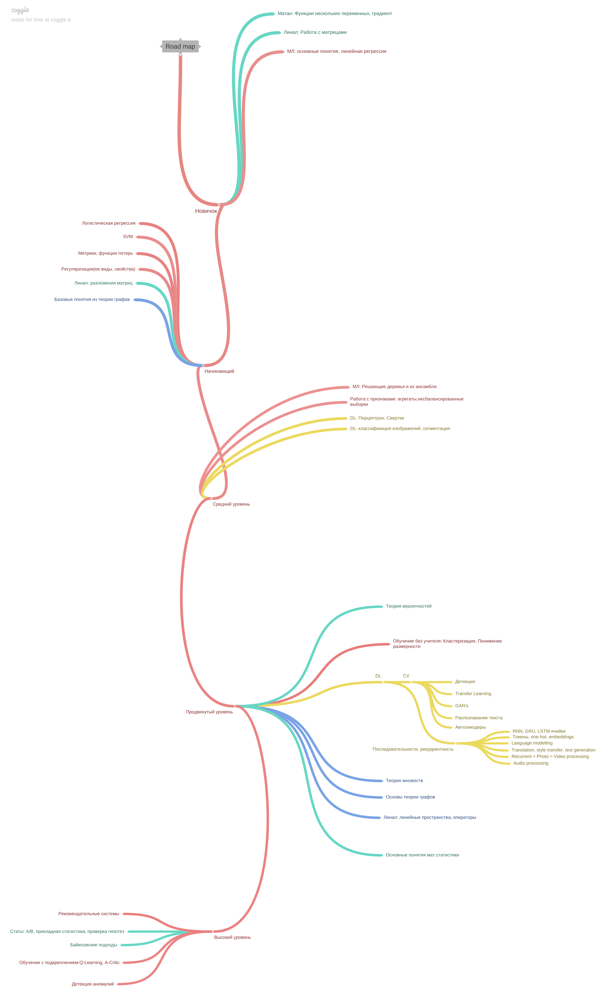

# Дорожная карта
Тут представлен один из возможных путей развития в МЛ. Карта со временем дополняется.
После карты можно посмотреть на описание и ссылки для каждого листа дерева. 

Есть полезный и понятный материал - скинь в беседу

## Python

Для ленивых:
   - [Базовый](https://stepik.org/course/67/syllabus) курс 
   - [Продвинутый](https://stepik.org/course/512/syllabus) курс
   - [Базовые штуки в pandas](https://pandas.pydata.org/docs/getting_started/intro_tutorials/index.html)

Для целеустремлённых:
   - [Python Object oriented Programming](https://www.amazon.com/Python-Object-oriented-Programming-Building-maintainable/dp/1784398780) по сути практический гайд по тому, как писать не отвратительный код [pdf](https://vk.com/proglib/books?w=wall-54530371_323883)
   - [High performance Python](https://www.amazon.com/High-Performance-Python-Performant-Programming/dp/1492055026) про оптимизации кода, параллельность и экономию железа. [фулл](https://vk.com/doc22120388_437615949?hash=a7d8affb64ea7f0e2a&dl=7b70932342fb19bf5d)

## Pytorch
- [Кишки torch.Tensor и autograd](http://blog.ezyang.com/2019/05/pytorch-internals/)
- [Дока](https://pytorch.org/docs/stable/index.html)
- [Dataset и DataLoader](https://pytorch.org/tutorials/beginner/basics/data_tutorial.html)
- [Сохранение весов](https://pytorch.org/tutorials/beginner/basics/saveloadrun_tutorial.html)

## Математика

Ознакомительно:
   - Матан: [ФНП](http://mathprofi.ru/funkcija_dvuh_peremennyh_oblast_opredelenija_linii_urovnja.html) [Градиент](http://mathprofi.ru/proizvodnaja_po_napravleniju_i_gradient.html), [Экстремумы ФНП](http://mathprofi.ru/extremumy_funkcij_dvuh_i_treh_peremennyh.html).
   - Линал: [Лекция DLS](https://www.youtube.com/watch?v=MJlNjtwzgH4&ab_channel=DeepLearningSchool), [Семинар DLS](https://www.youtube.com/watch?v=8dQacKEwLCQ&ab_channel=DeepLearningSchool)
   - [Deeplearning Book](https://github.com/janishar/mit-deep-learning-book-pdf/blob/master/complete-book-bookmarked-pdf/deeplearningbook.pdf) главы 2-5, базовый линал для ML, методы оптимизации и категории ML алгоритмов
   - [Курс по теорверу](https://stepik.org/course/3089)

Фундаментально:
   - Теория Графов: Шевелев/Харари
   - Теория множеств: Шевелев, 1 семестр дискретки(вполне хватает, если хорошо учить)
   - Основные понятия мат.статистики: Гмурман: Выборка, Оценки, Доверительные интервалы, Корреляция и лин.регрессия, Бутстрэп

## Классический ML

Ознакомительно:
   - [Курс](https://youtu.be/OBG6EUSRC9g?list=PLEqoHzpnmTfDwuwrFHWVHdr1-qJsfqCUX) от ФКН ВШЭ. Линейные и нелинейные модели, метрики, деревья решений, ансамбирование, кластеризация, уменьшение размерности
   - [Курс](https://www.youtube.com/channel/UCMtArJYNAfheQ56AtjBj_SA) от Лаборатории машинного обучения ИТМО, лекции 1-6
   - [Регуляризация(см L1, L2, ElastikNet)](https://neerc.ifmo.ru/wiki/index.php?title=%D0%A0%D0%B5%D0%B3%D1%83%D0%BB%D1%8F%D1%80%D0%B8%D0%B7%D0%B0%D1%86%D0%B8%D1%8F), [ещё 7 глава тут](https://github.com/janishar/mit-deep-learning-book-pdf/blob/master/complete-book-bookmarked-pdf/deeplearningbook.pdf)
   - [Кластеризация](https://neerc.ifmo.ru/wiki/index.php?title=%D0%9A%D0%BB%D0%B0%D1%81%D1%82%D0%B5%D1%80%D0%B8%D0%B7%D0%B0%D1%86%D0%B8%D1%8F), Понижение размерности: PCA, SVD
   - [Компьютерное зрение (нет, не нейросети)](youtube.com/playlist?list=PLcsjsqLLSfND4bGJH6vZ9Xs2rhPbmH946)
   - [Книга по компьютерному зрению (опять не нейросети)](https://www.combook.ru/product/11307454/?gclid=Cj0KCQjw_8mHBhClARIsABfFgpihRKPhW6dQoX3c1UAdT29mKNfpXxCvE64K3lWSKwzOM_i6NJLLsfIaAmMvEALw_wcB)

Фундаментально:
   - Книжка [Hands-On Machine Learning](https://www.oreilly.com/library/view/hands-on-machine-learning/9781492032632/) 3-8 главы, фулл [здесь](https://t.me/machinelearningtoday), rus вариант есть в чате

## Нейронные сети и deep learning

Ознакомительно:
   - [Курс](https://stepik.org/course/50352/syllabus) Samsung AI Center
   - [Deep Learning School NLP course](https://www.youtube.com/watch?v=d0oV1MZ_KdE&list=PL0Ks75aof3Ti1GDgeePUkCJWn02c0VDA5)

Фундаментально:
   - [Deeplearning Book](https://github.com/janishar/mit-deep-learning-book-pdf/blob/master/complete-book-bookmarked-pdf/deeplearningbook.pdf) 8 глава подробнее про методы оптимизации
   - [Deeplearning Book](https://github.com/janishar/mit-deep-learning-book-pdf/blob/master/complete-book-bookmarked-pdf/deeplearningbook.pdf) 6, 9-11 главы - DL архитектуры для работы с разными видами данных
   - Deep Learning School

## Development

- [JupyterLab](http://jupyterlab.io/install)
- PyCharm
- [Методология git flow](https://www.gitkraken.com/learn/git/git-flow)
- TensorBoard, Weights&Biases

## Выжимки информации, собеседования

- [Data science cheetsheet](https://github.com/aaronwangy/Data-Science-Cheatsheet/blob/main/Data_Science_Cheatsheet.pdf)
- [Краткая теория на английском про классический ML](https://github.com/alexeygrigorev/data-science-interviews/blob/master/theory.md)

## Резюме

- [Тут](https://www.overleaf.com) можно натехать что-то красивое
- Минималистичный [пример](https://github.com/zachscrivena/simple-resume-cv)
- Чуть менее минималистичный [пример](https://github.com/dcetin/Simple-CV)
