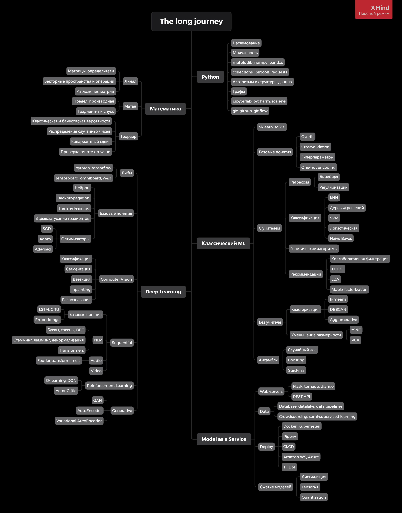

# Дорожная карта
Тут представлен один из возможных путей развития в МЛ. Карта со временем дополняется.
После карты можно посмотреть на описание и ссылки для каждого листа дерева. 

Если вы видите недостаток в предложенной ссылке, есть материал, который объясняет лучше - напишите в беседу. 

## Новичок 

Матан: [ФНП](http://mathprofi.ru/funkcija_dvuh_peremennyh_oblast_opredelenija_linii_urovnja.html) [Градиент](http://mathprofi.ru/proizvodnaja_po_napravleniju_i_gradient.html), [Экстремумы ФНП](http://mathprofi.ru/extremumy_funkcij_dvuh_i_treh_peremennyh.html).

Линал: [Лекция](https://www.youtube.com/watch?v=MJlNjtwzgH4&ab_channel=DeepLearningSchool), [Семинар](https://www.youtube.com/watch?v=8dQacKEwLCQ&ab_channel=DeepLearningSchool)

МЛ: [Основные понятия](https://www.youtube.com/watch?v=8s9073kNXgY&list=PL4_hYwCyhAvZyW6qS58x4uElZgAkMVUvj&ab_channel=%D0%9B%D0%B5%D0%BA%D1%82%D0%BE%D1%80%D0%B8%D0%B9%D0%A4%D0%9F%D0%9C%D0%98), [Линейная регрессия](https://www.youtube.com/watch?v=GKIkGc2bnmU&list=PL4_hYwCyhAvZyW6qS58x4uElZgAkMVUvj&index=2&ab_channel=%D0%9B%D0%B5%D0%BA%D1%82%D0%BE%D1%80%D0%B8%D0%B9%D0%A4%D0%9F%D0%9C%D0%98)

## Начинающий

[SVM](https://habr.com/ru/company/ods/blog/484148/)

[Логистическая регрессия и метрики](https://www.youtube.com/watch?v=_SUJsDLtJsE&list=PL4_hYwCyhAvZyW6qS58x4uElZgAkMVUvj&index=3&ab_channel=%D0%9B%D0%B5%D0%BA%D1%82%D0%BE%D1%80%D0%B8%D0%B9%D0%A4%D0%9F%D0%9C%D0%98)

[Регуляризация(см L1, L2, ElastikNet)](https://neerc.ifmo.ru/wiki/index.php?title=%D0%A0%D0%B5%D0%B3%D1%83%D0%BB%D1%8F%D1%80%D0%B8%D0%B7%D0%B0%D1%86%D0%B8%D1%8F)

[PCA видео](https://www.youtube.com/watch?v=NKmwnILrHD8&ab_channel=%D0%9E%D1%81%D0%BD%D0%BE%D0%B2%D1%8B%D0%B0%D0%BD%D0%B0%D0%BB%D0%B8%D0%B7%D0%B0%D0%B4%D0%B0%D0%BD%D0%BD%D1%8B%D1%85), [PCA текст](https://ru.wikipedia.org/wiki/%D0%9C%D0%B5%D1%82%D0%BE%D0%B4_%D0%B3%D0%BB%D0%B0%D0%B2%D0%BD%D1%8B%D1%85_%D0%BA%D0%BE%D0%BC%D0%BF%D0%BE%D0%BD%D0%B5%D0%BD%D1%82)

Теория Графов: Шевелев, Теория Графов, Вводные понятия.

## Средний уровень
[Решающие деревья](https://www.youtube.com/watch?v=-0Do2_WIJAQ&list=PL4_hYwCyhAvZyW6qS58x4uElZgAkMVUvj&index=6&ab_channel=%D0%9B%D0%B5%D0%BA%D1%82%D0%BE%D1%80%D0%B8%D0%B9%D0%A4%D0%9F%D0%9C%D0%98), [Градиентный Бустинг](https://www.youtube.com/watch?v=hTECDpL_JYM&list=PL4_hYwCyhAvZyW6qS58x4uElZgAkMVUvj&index=7&ab_channel=%D0%9B%D0%B5%D0%BA%D1%82%D0%BE%D1%80%D0%B8%D0%B9%D0%A4%D0%9F%D0%9C%D0%98)

[Несбалансированная выборка](https://basegroup.ru/community/articles/imbalance-datasets)

Перцептрон и ДЛ: DLS на ютюбе 5-11 лекции+семинары

## Продвинутый уровень

[Теорвер](https://stepik.org/course/3089/syllabus?auth=login), Гмурман(учебник)

[Кластеризация](https://neerc.ifmo.ru/wiki/index.php?title=%D0%9A%D0%BB%D0%B0%D1%81%D1%82%D0%B5%D1%80%D0%B8%D0%B7%D0%B0%D1%86%D0%B8%D1%8F), Понижение размерности: PCA, SVD

Теория множеств: Шевелев, 1 семестр дискретки(вполне хватает, если хорошо учить)

Теория графов: Шевелев, 2 семестр дискретки(см т.м)

Линал: ...

Основные понятия мат.статистики: Гмурман: Выборка, Оценки, Доверительные интервалы, Корреляция и лин.регрессия, Бутстрэп

ДЛ:DLS - 1, 2 курсы

## Высокий уровень

